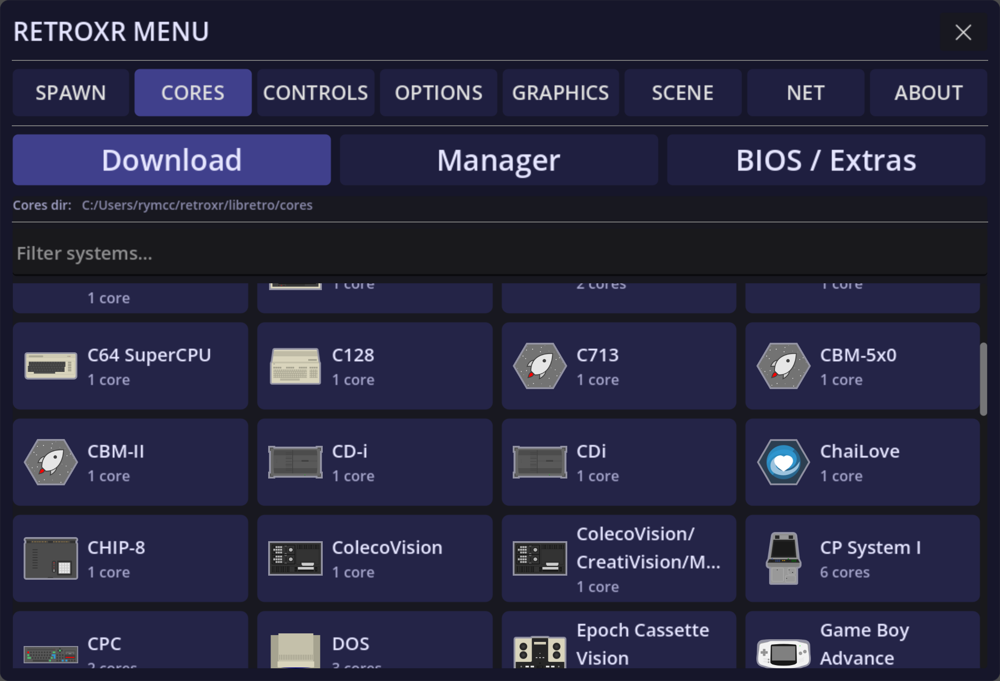
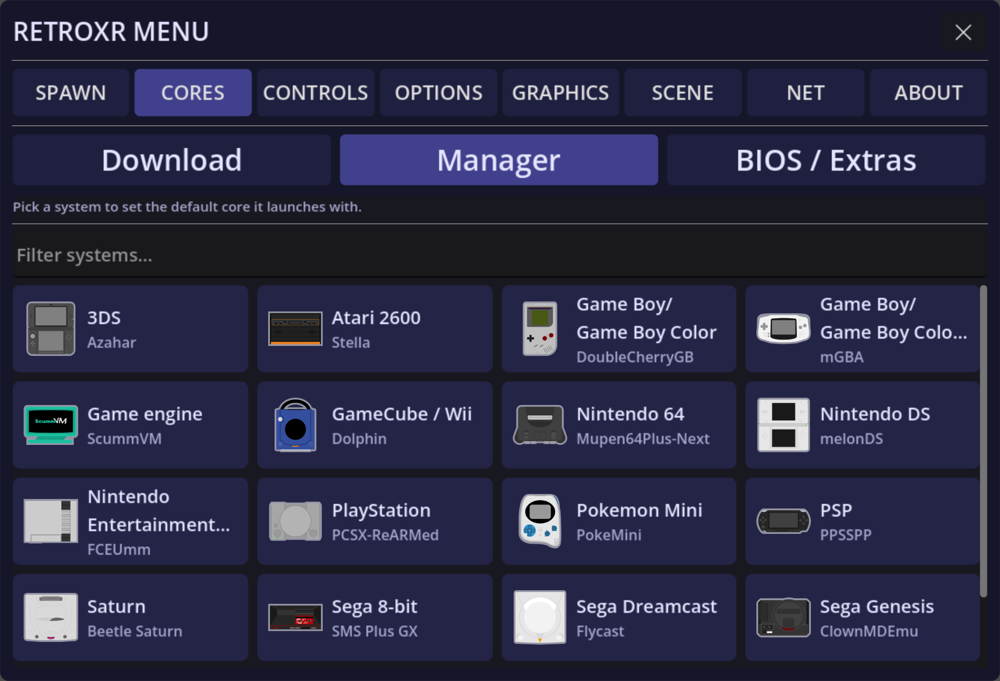
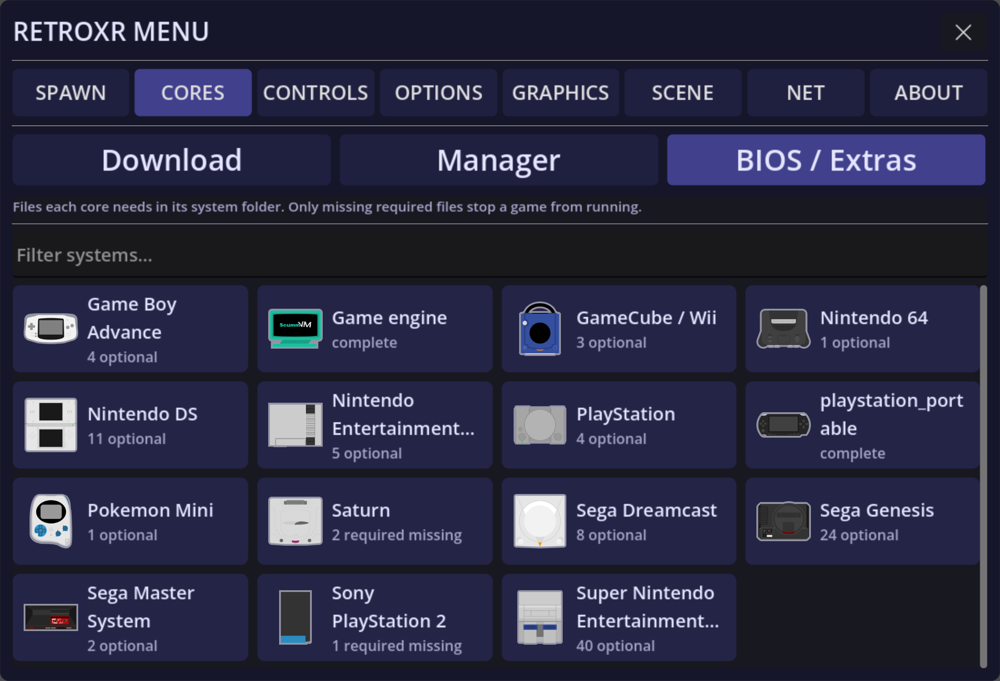
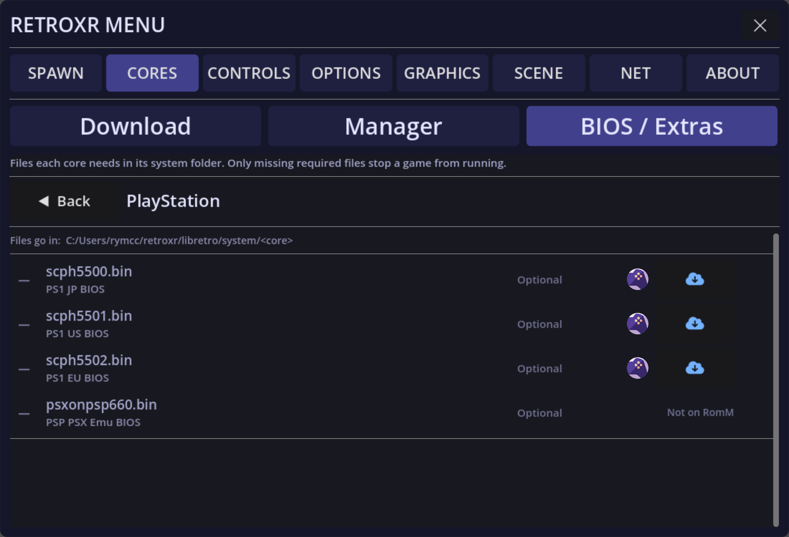
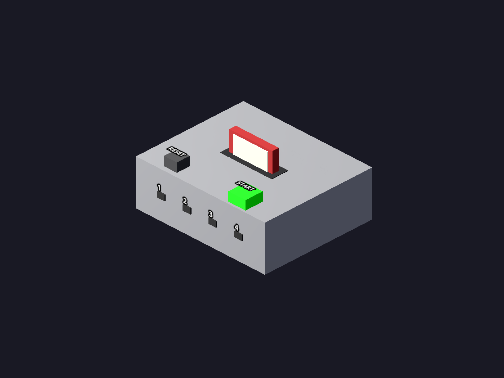
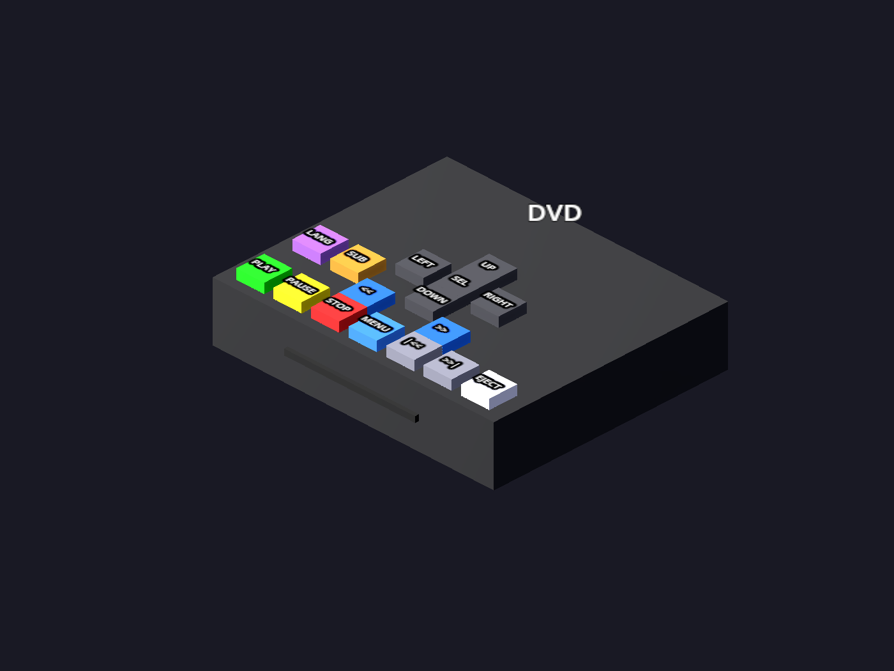
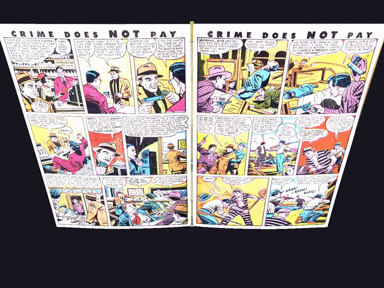
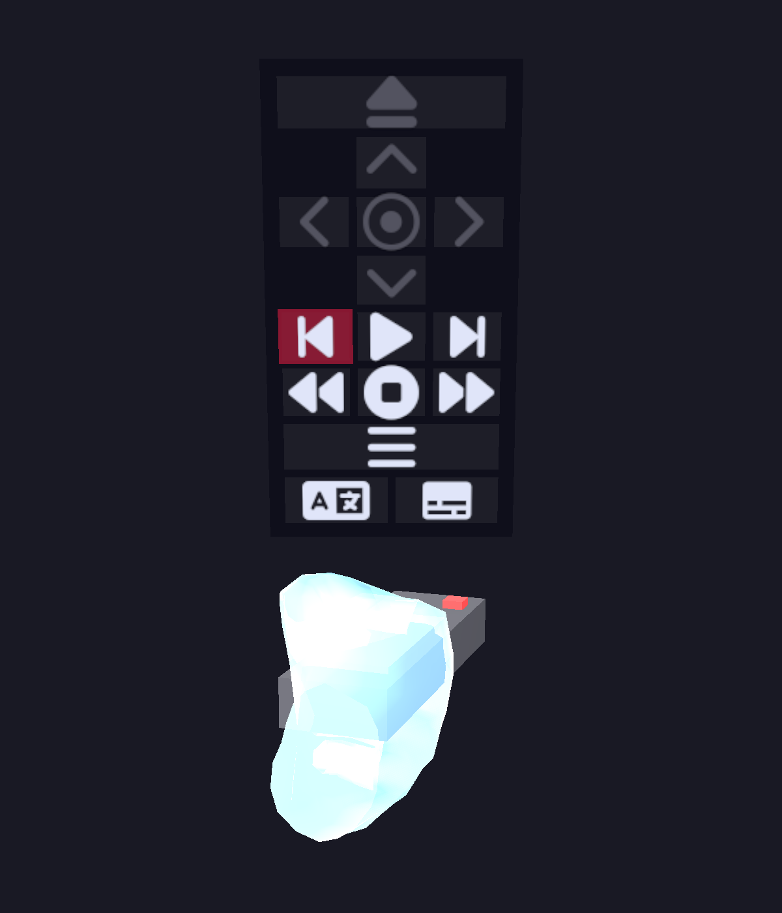

# RetroXR

A VR retro-gaming room in Godot 4: real emulated hardware you pick up, plug in and
play with, driven by libretro cores.

The goal is for this to be an open project aimed at recreating what it was like to own a
console at the time, forgoing all the emulation windows and setup hassle.
You just spawn the consoles, TVs, and cartridges, and pop everything together naturally.
This means plugging in the AV cables, plugging in the disc or cartridge, and plugging in
the controller as well.

Right now, all models of consoles just have primitive stand-ins. These are just gray or
red boxes.
**If you are a modeller and can help out, please do! Just note that all models must be**
**free of any trademarked text or images.**

This project also aims to be the same for DVDs, VHS, CDs, cassettes, and books/magazines.
Just copy over your book, DVD image, video file, or audio file to the directory via the
web interface and you're good to go!

This project also supports RomM connections. Generate an API key from your RomM server,
and even scan the QR code to link it from your Quest with the external camera!

This has the Meta XR Audio SDK integrated as well, so for any sound you hear you can
always tell where it's coming from thanks to the HRTF processing.

There is netplay as well with a roll-back netcode, but it is very untested!

## Libretro Cores

### Downloader

Each platform can have multiple cores. Select the one you want. For some there's a highly
recommended core — for example, the Azahar core supports stereoscopic imaging in VR.



### Manager

Select the default core for each platform in here. Also set or reset core options.



### BIOS / Extra

Manage and see if any BIOS are required or optional. If RomM is set up, it can download
them from there.





## Objects

### System

Spawn a system for any platform you have at least one libretro core for. In here you can
spawn controllers, peripherals, and the console itself by selecting them.



### Cartridge

Spawn a Cartridge which is linked to a supported file for the platform.

### DVD player

Like the VCR, the DVD player renders onto a connected TV through the in-tree `vlc-godot`
GDExtension — the same [libVLC](https://www.videolan.org/vlc/libvlc.html)-backed `VlcPlayer`
is the single video backend for both. VLC's bundled `libdvdnav`/`libdvdread` plugins give it
real disc menus and chapter navigation.

1. Drop DVD images into the `dvd/` folder (next to `roms/`, `books/` and `videos/`):
   - Windows: `%USERPROFILE%\retroxr\dvd`
   - Linux: `~/retroxr/dvd`
   - Quest/Android: `/sdcard/Android/data/com.xenu.retroxr/files/dvd`
   - Supported: a folder containing a `VIDEO_TS/` directory, or a standalone `.iso` / `.img` file.
2. Open the spawn menu (`Tab`), go to the **DVDs** tab, and click a title to spawn a
   **DVD disc** carrying that image's path (like a VHS tape carries a video path).
3. From the **Objects** tab, spawn a **DVD Player** and a **TV**.
4. Plug the DVD player's cable into the TV (same cable/plug the emulator systems and VCR use).
5. Insert the disc into the player's slot, then press **Play** — inserting alone never
   auto-starts playback.

On-unit buttons: **PLAY**, **PAUSE**, **STOP**, **EJECT**, **|&lt;&lt;** / **&gt;&gt;|**
(previous / next chapter), **&lt;&lt;** / **&gt;&gt;** (rewind / fast-forward scan), **MENU**
(return to the disc's root menu), a **UP** / **DOWN** / **LEFT** / **RIGHT** / **SEL** cluster
for navigating disc menus, and **LANG** / **SUB** to cycle audio and subtitle tracks. Point at
the player and press the menu button to open a floating panel that picks audio/subtitle tracks
by name.

As with the VCR, the video renders onto the connected TV's screen, and the TV's volume/power
buttons drive the DVD player's audio and screen just like a system.



### Books / Magazines

Books and magazines are physical objects you pick up and read by turning the pages with your
hands. Pages are rendered from the file by the in-tree `godot-pdfium` GDExtension — a
[PDFium](https://pdfium.googlesource.com/pdfium/)-backed `PDFRenderer` that rasterises each
page to a texture (asynchronously, and cached to disk so re-opening a book is instant).

1. Drop books into the `books/` folder (next to `roms/`, `dvd/` and `videos/`):
   - Windows: `%USERPROFILE%\retroxr\books`
   - Linux: `~/retroxr/books`
   - Quest/Android: `/sdcard/Android/data/com.xenu.retroxr/files/books`
   - Supported: `.pdf` and `.cbz` (a ZIP of `.jpg`/`.png`/`.webp` page images). CBR and loose
     image files are not listed.
2. Open the spawn menu (`Tab`), go to the **Books** tab, and click a title to spawn it — the
   book drops straight into the hand that clicked. (Scraped game manuals also spawn from the
   📖 button on a ROM's row in the **Cartridges** tab.)
3. Turn the pages:
   - **VR**: hover a controller over a page's outer edge, hold the **trigger**, and drag the
     page across — release past halfway to complete the turn, or short of it to let it spring
     back. Or, holding the book one-handed, poke the far edge with your other hand and squeeze
     **grip** to flip.
   - **Desktop**: with the book held, `E` = next page, `Q` = previous page.
4. Point at the book and press the menu button to open **Book Settings**: a size slider
   (0.5×–2.5×) and a "half pages" toggle that splits scanned two-page spreads down the middle.

Set a book down on any shelf or desk to leave it out, and pick it back up with grip (VR) or
the pointer ray.



### Video player (VCR)

Besides emulator systems, the arcade room can play video files on the same TVs, driven by
the in-tree `vlc-godot` GDExtension — a [libVLC](https://www.videolan.org/vlc/libvlc.html)
backed `VlcPlayer`. It is the single video backend for both the VCR and the DVD player,
and it handles x265/HEVC.

1. Drop video files into the `videos/` folder (next to `roms/` and `books/`):
   - Windows: `%USERPROFILE%\retroxr\videos`
   - Quest/Android: `/sdcard/Android/data/com.xenu.retroxr/files/videos`
   - Supported: `.mp4`, `.mkv`, `.avi`, `.webm`, `.mov`
2. Open the spawn menu (`Tab`), go to the **Videos** tab, and click a video to spawn a
   **VHS tape** carrying that file's path (like a cartridge carries a ROM path).
3. From the **Objects** tab, spawn a **VCR** and a **TV**.
4. Plug the VCR's cable into the TV (same cable/plug the emulator systems use).
5. Insert the tape into the VCR's slot, then use the on-unit buttons:
   **Play**, **Pause**, **Stop** (eject/blank), **&lt;&lt;** (rewind), **&gt;&gt;** (fast-forward).

The video renders onto the connected TV's screen, and the TV's volume/power buttons
control the VCR's audio and screen just like a system.


### TV remote

Spawn a **TV Remote** from the spawn menu's **Objects** tab. While held, point it at a
TV, VCR, DVD player, or CD/cassette deck — the target is outlined maroon and a small menu
pops up above the remote:

- **TV**: `POWER` / `VOL −` / `MUTE` / `VOL +`
- **VCR**: `EJECT` / `PLAY` / `PAUSE` / `STOP` / `FF` / `REW`
- **DVD player**: `EJECT` / `PLAY` / `PAUSE` / `STOP` / `FF` / `REW`, chapter skip
  (`|<<` / `>>|`), `MENU` and a `UP` / `DOWN` / `LEFT` / `RIGHT` / `OK` cluster for the
  disc's own menus, and `AUDIO` / `SUB` track cycling. Menu-navigation cells light up only
  while a disc menu is showing; `AUDIO` / `SUB` only during playback.
- **CD / cassette deck**: `PLAY` / `PAUSE` / `STOP` / `FF` / `REW`, plus track skip
  (`|<<` / `>>|`) on the CD player (a cassette can't skip tracks, so those cells stay greyed).

On the remote itself `PLAY`/`PAUSE` is a single cell whose icon toggles with playback state,
and the buttons show as icons rather than text — the word labels above are how each action
reads on the TV's on-screen display.

**VR**: flick the thumbstick up/down to move the selection, press the primary button
(`A`/`X`) or click the thumbstick to activate.

**Desktop**: the remote snaps to the lower-right corner aiming where you look (like the
ray gun). `Arrow Up`/`Arrow Down` move the selection, `Enter` activates, and — because
it is FPS-snapped — dropping it requires **`Ctrl` + Left-click** (plain click won't drop it).



## Development

### Building

Almost everything interesting here is C++. Five GDExtensions have to be compiled
before the Godot project will run — a fresh clone has the sources but not the
libraries. Miss one and Godot says so on startup, then every scene using its types
fails to parse:

```
ERROR: GDExtension dynamic library not found: 'res://verlet-rope/verlet_rope.gdextension'.
SCRIPT ERROR: Parse Error: Could not find type "VerletRope" in the current scope.
```

| Extension | Provides | Built from | Deploys to |
|---|---|---|---|
| `libretro-godot` | `Libretro` — runs the emulator cores (submodule) | repo root | `RetroXR/libretro-godot/` |
| `verlet-rope` | `VerletRope` — the simulated cables | `verlet-rope/` | `RetroXR/verlet-rope/` |
| `vlc-godot` | `VlcPlayer` — video for the VCR and DVD player | `vlc-godot/` | `RetroXR/vlc-godot/` |
| `godot-pdfium` | `PDFRenderer` — renders manual pages | `godot-pdfium/` | `RetroXR/godot-pdfium/` |
| `metaxr-audio` | HRTF spatial audio on Quest | `metaxr-audio-godot/` | `RetroXR/metaxr-audio/` |

**Each needs its own `scons` invocation.** They share the `godot-cpp` submodule, and
godot-cpp's `SConstruct` can only run once per process, so a single scons run can never
cover two of them. Each also has its own `VariantDir('Temp')`, which is why each builds
from its own directory — except `libretro-godot`, whose SConstruct is the repo root's.

#### Prerequisites

```bash
git submodule update --init --recursive     # godot-cpp, libretro-common, vulkan-headers
pip install --user scons                    # ensure the Scripts/bin dir is on PATH
```

Plus a compiler: **MSVC** on Windows, **GCC/Clang** on Linux, the **Android NDK** for
Quest (set `ANDROID_NDK_ROOT`; `ANDROID_HOME` must be *empty*, not unset, or godot-cpp
looks for a full SDK).

Every third-party binary these link against is already committed — PDFium for all three
platforms, the libVLC import libraries and Android `libvlc.so`, the Meta XR Audio blob.
The one exception is **libVLC on Linux**, which links the system library (Fedora:
`vlc-devel` to build, `vlc-libs` to run).

#### One command

```bash
python Tools/build.py windows                 # all five, debug + release
python Tools/build.py android --target release
python Tools/build.py linux --only vlc-godot
python Tools/build.py windows --jobs 8 -- verbose=yes    # extra args go to scons
```

It runs the five builds in sequence, prints a pass/fail table, and exits non-zero if any
failed. Architecture follows the platform: `x86_64` for windows and linux, `arm64` for
android.

Asking for `linux` **from Windows** re-invokes the script inside WSL (`--distro`, default
`Ubuntu`) with `HOME` and `PATH` reset — WSL inherits the Windows environment, whose PATH
contains spaces and breaks a bare `export PATH="$HOME/.local/bin:$PATH"`. From Linux it
just builds. *(scons is not currently installed in either WSL distro here; `pip install
--user scons` inside the distro first.)*

#### Or one at a time

```bash
scons platform=windows arch=x86_64 target=template_debug          # libretro-godot, from the root
cd verlet-rope && scons platform=linux arch=x86_64 target=template_release
cd godot-pdfium && scons platform=android arch=arm64 target=template_debug ANDROID_HOME=
```

Each writes a `lib<name>.<platform>.<target>.<arch>.so` (or `.dll`) next to the
`.gdextension` file that points at it.

## Desktop mode controls

When no VR headset is detected, RetroXR falls back to a desktop mode with mouse/keyboard controls.

**Movement / camera**
- `WASD` — move
- Mouse — look
- `Ctrl` (hold) — crouch
- `Caps Lock` (hold) — walk (move slower, finer-grained control)

**Interaction**
- Left-click — grab/pick up object under cursor (or shoot, if holding the ray gun)
- `Ctrl` + Left-click — drop held object (required for FPS-snapped objects: ray gun,
  TV remote; plain click also drops everything else)
- Scroll wheel — push/pull held object along view ray (disabled while FPS-snapped)
- Middle-mouse drag — rotate held object in place
- `Tab` — toggle spawn menu

**Retro joypad** (when a Libretro node has input focus)
- D-pad: `W`/`A`/`S`/`D`
- Face buttons: Numpad `1`=B, `2`=A, `3`=Y, `4`=X
- Shoulders: `L`=`Q`/`R`/Numpad3, `R`=`E`/`Y`/Numpad6
- Triggers: `L2`=`Z`, `R2`=`X`
- Stick clicks: `L3`=`C`, `R3`=`V`
- `Shift`=Select, `Enter`=Start
- Left stick: `T`/`G`/`F`/`H` (up/down/left/right)
- Right stick: `I`/`K`/`J`/`L` (up/down/left/right)
